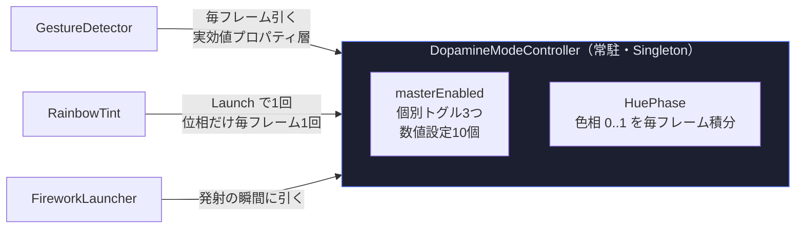
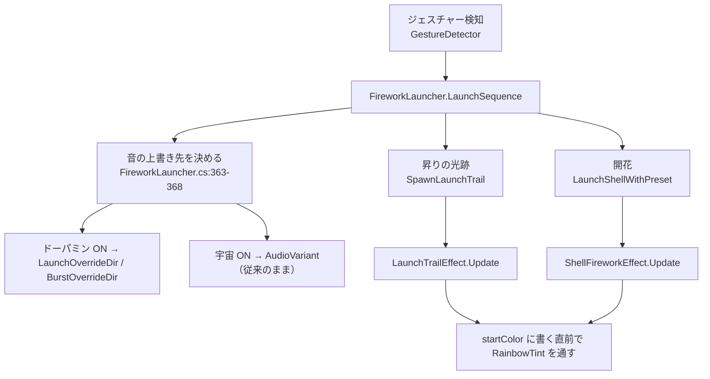
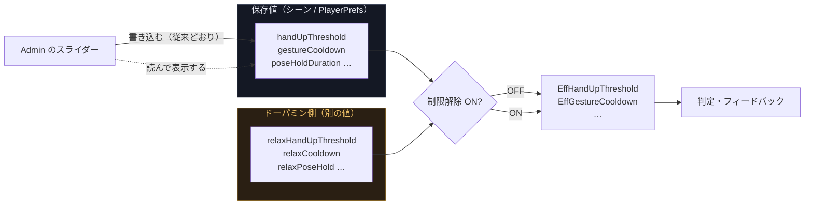
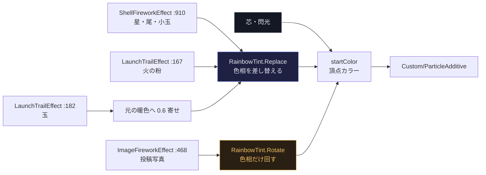
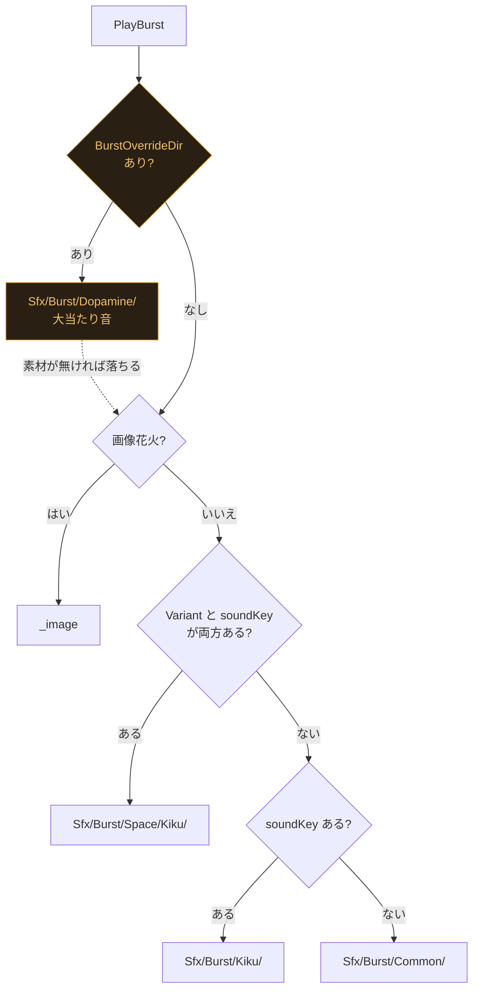

# ドーパミンモード

## Context

AR花火は「ジェスチャーで花火が上がる」体験で、ここまでの作り込みは
**判定を正しくすること**に向いてきた。y軸の向きの誤りを直し、見えていない関節を弾き、
1フレーム1発を構造的に保証した。その結果、いまは「やったことが正しく返ってくる」状態になっている。

ただ、正しさと引き換えに **驚きの山が無い**。
展示は無人・自由入退場で、説明する人は居ない。通りすがりの人に
「なにこれ」と足を止めさせる瞬間が、どこかに1つ要る。

そこで、通常の体験とは別に **ドーパミンモード** を用意する。
ON の間だけ、次の3つを同時に振り切る。

- **光** … 花火を虹色に光らせる（粒ごとに虹色＋時間で色相が回る）
- **判定** … しきい値を最小、クールダウン 0。動けば出る
- **音** … 打ち上げ＝パチンコの「先バレ」風、開花＝「大当たり」風のファンファーレ

これは通常運用のための機能ではない。
**盛り上げたい時間帯だけ管理画面から入れる飛び道具**として設計する。

### 最重要の制約

> **OFF に戻したとき、通常の設定が一切汚れていないこと。**

展示は複数日にまたがり、現場で調整した判定のしきい値が PlayerPrefs に蓄積されている。
ドーパミンモードがその値を書き換えて戻す方式だと、
**ON のまま電源が落ちた翌日、緩めきった状態で開場する**。
この事故の損害は、モードをもう一度 ON にする手間とは比べものにならない。
以下の設計は、ほぼすべてこの1点から導かれている。

### 確定した方針

| 論点 | 決定 | 理由 |
|---|---|---|
| 音源 | 実機の音は使わない。既存の合成パイプラインで「それっぽい音」を焼く | パチンコ実機の音はメーカーに著作権がある。学祭の展示で流すには合成が安全 |
| 虹色 | 粒ごとに虹色＋時間で色相が回る。回る速さは設定項目 | 「光りながら」がいちばん強く出る |
| 宇宙モードとの関係 | 同時 ON 可能。競合する要素はドーパミンが上書き | どの型を出すかは宇宙、何色に塗るかはドーパミン、と軸を分ければ両立する |
| 判定の緩め方 | しきい値を最小＋クールダウン 0 | ジェスチャーの種類判定そのものは残す（後述） |

---

## 調査で分かった現状（設計の起点）

### モードの作り方には確立した型がある

`Scripts/Space/SpaceModeController.cs` と `Scripts/Experience/ExperienceDirector.cs` が
ほぼ同一の構造を持っている。ドーパミンモードはこれを3つ目としてそのまま踏襲する。
**新しく考える設計を1つも持ち込まない**のが、この機能でいちばん確実な選択になる。

- Singleton `Instance` ／ `masterEnabled` ＋ 個別 bool
- 実効値 `XxxEnabled => masterEnabled && xxx`（呼び出し側はこれだけを見る。`&&` の書き忘れを構造的に防ぐ）
- ラベル用の生値 `XxxSetting => xxx`（マスター OFF 中も個別設定を見せる）
- `Key*` 定数は `nameof(クラス名) + "." + nameof(フィールド名)`。`SettingsStore` が `"ARHanabi."` を前置
- `GetOrCreate()` ＋ `[RuntimeInitializeOnLoadMethod(AfterSceneLoad)] Bootstrap()`
- 消費側は `Instance != null && Instance.XxxEnabled` を**毎フレーム直接読む**
  （`CockpitFrameOverlay.cs:215`、`UfoSpawner.cs:60`、`FireworkLauncher.cs:366`）。
  購読しないのは、起動順の組み合わせを考えなくて済むから

### 色は3エフェクトとも1本道に収束している

型花火・画像花火・昇りの光跡はいずれも `Custom/ParticleAdditive` を使い、
**色は 100% 頂点カラー**（`ParticleSystem.Particle.startColor`）で決まる。
書き込み点は次の4行しかない。

| エフェクト | 書き込み点 |
|---|---|
| 型花火 | `ShellFireworkEffect.cs:910` |
| 画像花火 | `ImageFireworkEffect.cs:468-470` |
| 昇りの光跡（火の粉） | `LaunchTrailEffect.cs:167-168` |
| 昇りの光跡（玉） | `LaunchTrailEffect.cs:182` |

**グローバルに色を上書きするフックは存在しない**。
`Shader.SetGlobalColor` は `Assets/` 配下に0件、`MaterialPropertyBlock` は未使用、
共通マテリアルも無い（マテリアルは1発につき1個動的生成され、`OnDestroy` で破棄される）。
逆に言えば、この4行に同じ関数を1つ挟めば全経路を掌握できる。

> ⚠️ `ShellPreset` は `[Serializable]` の**参照型**で、`ShellPresetLibrary`（ScriptableObject）が
> 持つインスタンスがそのまま `fx.Launch(preset, ...)` に渡る。
> 実行時に `colorA` を書き換えると **Asset に焼き付き、Play を抜けても元に戻らない**。
> 色の差し替えは**プリセットではなく粒の書き込み点で**行う。

### 音はバリアント1文字列で切り替わるが、目的が逆

`FireworkAudioPlayer.AudioVariant`（:93）に文字列を入れると
`Sfx/Launch/<Variant>/` と `Sfx/Burst/<Variant>/<soundKey>/` を先に引く。
書き込み点は `FireworkLauncher.cs:363-368` の1箇所だけ（宇宙モードなら `"Space"`）。

ただし `AudioVariant` は「モードごとに、**型の差を保ったまま**鳴らし分ける」ための軸で、
ドーパミンモードが欲しいのは**その逆**（型を無視して必ず同じ音）。
実際、同じ仕組みに乗せようとすると次の壁に当たる。

1. `ResolveBurstClips`（:384-396）は Variant と soundKey が**両方非空のときしか**バリアント引きをしない
2. 画像花火（`kind == Image`）は :386 で**即 `_image` を返しバリアントが一切効かない**
3. 結果、`Sfx/Burst/Dopamine/{Kiku,Botan,…}/` に同じ wav を12個複製する羽目になり、
   しかも**型を1つ足した人が静かに大当たり音を失う**（気づけない壊れ方をする）

SE の合成は道具が揃っている。
`Editor/FireworkSoundSynth.cs`（レシピ→波形）＋ `Editor/AudioDsp.cs`、
`Editor/FireworkSoundBaker.cs`（メニュー `ARHanabi > 花火の効果音を生成` → `Assets/ARHanabi/Audio/Generated/`）、
`Editor/FireworkAudioWirer.cs`（インポート設定を整える）。

### しきい値の一時上書きに既存 API を使ってはいけない

`GestureDetector` の公開プロパティ `HandUpThreshold`(:314) `JumpRiseThreshold`(:321)
`GestureCooldown`(:327) `PoseHoldDuration`(:333) は、
**setter が `SettingsStore.SetFloat` を即呼び PlayerPrefs に保存する**。
これで一時上書きすると、冒頭の「最重要の制約」を真っ向から破る。
さらに `landmarkVisibility`(:183) と `minShoulderWidth`(:199) には公開 API 自体が無い。

一方で好都合な事実もある。
**値は毎フレーム field を直読みしていて、どこにもキャッシュされていない**
（:417, :428, :433-434, :571, :594, :688, :698, :767）。
`PersonState` も時刻ベースで、しきい値を焼き込んでいない。
つまり**読む場所を差し替えるだけで即座に効き、後始末が要らない**。

---

## 設計の原則

1. **「上書きして戻す」を一切やらない。「実効値を毎回引く」に統一する。**
   戻す処理が存在しなければ、戻し忘れも、戻す前に落ちる事故も、原理的に起きない。
2. **競合の優先順位は1か所に閉じる。**
   宇宙／ドーパミン／将来の第3のモードで組み合わせが増えるたびに
   全箇所を直すことにならないよう、判断する場所を分散させない。
3. **既定では挙動が変わらない。**
   新しい引数は既定値を「従来どおり」にして、既存の呼び出しを1文字も変えずに済ませる
   （`ShellPreset.twinkleRampUp`、`fadeHold/fadeCurve`、`AudioVariant` と同じ作法）。
4. **黙って反応しない状態を作らない。**
   モードの ON/OFF、除外の理由、実効値は必ずどこかに出す。

---

## アーキテクチャ

### 方針: 1つのコントローラ ＋ 純粋な色ユーティリティ

**矢印はすべて「引く側 → 引かれる側」。** コントローラは誰にも配らないし、誰も購読しない。
この向きが逆になった瞬間、起動順（`RuntimeInitializeOnLoadMethod` での自己生成と
シーン上のコンポーネント）の組み合わせを考える必要が出てくる。



### データフロー（1発ぶん）



型の抽選（`PickPreset`）はこの流れに入っていない。**ドーパミンは型を1つも触らない。**

---

## 各要素の設計

### 1. `DopamineModeController`（新規）

`Assets/ARHanabi/Scripts/Dopamine/DopamineModeController.cs`
（`Scripts/Space/` に `SpaceModeController` がある前例に揃えて1モード1フォルダ）

**マスター**

| フィールド | 既定 | 意味 |
|---|---|---|
| `masterEnabled` | `false` | 大元。飛び道具なので既定 OFF |

> ⚠️ **マスターだけは毎起動 OFF から始める**（個別設定は復元する）。
> 宇宙モードは「その会場の構成」なので前回の状態を引き継ぐのが正しいが、
> ドーパミンモードは「その瞬間の出し物」。
> `Awake` で `masterEnabled = false` を書き戻し、「OFF から開始しました」を1行ログに残す
> （現場で「昨日 ON にしたのに」と混乱しないため）。

**個別トグル（マスター OFF 中も独立に保持）**

| フィールド | 既定 | 効き先 |
|---|---|---|
| `rainbowEnabled` | `true` | 花火の色（型花火・画像花火・昇りの光跡） |
| `dopamineAudioEnabled` | `true` | 先バレ音／大当たり音への差し替え |
| `looseDetectionEnabled` | `true` | しきい値最小＋クールダウン0 |

**数値設定**

| フィールド | 既定 | 範囲 | 管理画面 | 意味 |
|---|---|---|---|---|
| `hueCycleHz` | `0.35` | 0.05〜2.0 | スライダー | 色相が1周する速さ（周/秒） |
| `relaxCooldown` | `0.0` | 0〜2.0 | スライダー | 連発防止の秒数。0 で無制限 |
| `relaxHandUpThreshold` | `0.15` | 0.05〜1.0 | スライダー | 手上げのきびしさ（肩幅比） |
| `relaxJumpRiseThreshold` | `0.12` | 0.05〜1.0 | スライダー | ジャンプの高さ（肩幅比） |
| `relaxPoseHold` | `0.0` | — | Inspector | 保持時間。0 で即発火 |
| `relaxOneHandExtraHold` | `0.0` | — | Inspector | 片手の追加待ち時間 |
| `relaxJumpRearm` | `0.15` | — | Inspector | 着地後の再武装間隔（通常は const 0.4） |
| `saturation` | `0.85` | — | Inspector | 虹の濃さ。1.0 にしないのは、実物の星も純色ではなく白が少し混ざるため |
| `hueSpread` | `0.55` | — | Inspector | 1発の中で粒がどれだけ散るか |
| `intensityBoost` | `1.25` | — | Inspector | 彩度を上げると輝度が落ちる分の補正（後述） |

`relax*` を定数ではなく**設定項目**にしたのは、「最小」が会場によって違うため。
カメラが遠ければ 0.15 でも厳しく、近ければ緩すぎる。現場で振り切れるように出しておく。

**色相の位相はコントローラが持つ**

```csharp
public float HuePhase { get; private set; }

private void Update()
{
    HuePhase = Mathf.Repeat(HuePhase + Time.deltaTime * hueCycleHz, 1f);
}
```

`Time.time * hueCycleHz` にしない理由が2つある。

1. 展示を何時間も回すと `Time.time` が大きくなり、`frac` の精度が落ちて色相の刻みが目に見えて粗くなる
2. **速さのスライダーを動かした瞬間に色が飛ばない**。`Time.time * hz` は hz を変えた瞬間に
   位相が不連続に跳ぶが、積分していれば速さだけが変わって色は連続に繋がる。
   本番中に管理画面でスライダーを触る前提なので、これは実用上かなり効く

**変更通知**

```csharp
public event System.Action OnChanged;   // Admin がラベルを再計算するために購読する
```

### 2. 判定の緩和 — 「上書き」ではなく「参照先の切り替え」

通常の設定値には**一切触れない**。`GestureDetector` が値を読むときに、
ドーパミンモードが ON なら**モード側が持つ別の値を読む**だけにする。

```csharp
private static DopamineModeController Dopa => DopamineModeController.Instance;
private static bool Loose => Dopa != null && Dopa.LooseDetectionEnabled;

private float EffHandUpThreshold   => Loose ? Dopa.RelaxHandUpThreshold : handUpThreshold;
private float EffGestureCooldown   => Loose ? Dopa.RelaxCooldown        : gestureCooldown;
// … 以下同様に6〜8本
```

図にすると、**保存値へ向かう矢印が1本も無い**ことがこの設計の全てになる。



Admin のスライダーが書き込む先は**常に保存値**で、モードの ON/OFF に関係なく変わらない。
だから「モード中に触った値が、OFF に戻した瞬間そのまま効く」が成立する。

これで得られるもの:

- 通常の値は書き換えられないので、**落ちても汚れない**（最重要の制約を構造的に満たす）
- **復帰処理が存在しない**（モードを OFF にした瞬間、読む先が戻るだけ）
- Admin のスライダーが指す保存値が動かないので、**表示が古くならない**
- ドーパミン側の値は独立して持てるので、**そのまま「モードの設定項目」になる**
- `Instance` が null（モードを置いていないシーン）なら全て従来どおり

参照は毎フレーム `Instance` を読む pull 方式にする。
push（モード側が Detector に値を配る）にすると、`RuntimeInitializeOnLoadMethod` での
自己生成とシーン上のコンポーネントの起動順を考える必要が出る。
`CockpitFrameOverlay` / `UfoSpawner` が毎フレーム `SpaceModeController.Instance` を
読んでいるのと同じ作法に揃える。

**差し替える読み出し箇所**（`GestureDetector.cs`）

| 行 | 現在 | 差し替え後 |
|---|---|---|
| :417, :419 | `minShoulderWidth` | `EffMinShoulderWidth` |
| :428, :526, :698 | `landmarkVisibility` | `EffLandmarkVisibility` |
| :433 | `shoulderWidth * handUpThreshold` | `* EffHandUpThreshold` |
| :434 | `shoulderWidth * jumpRiseThreshold` | `* EffJumpRiseThreshold` |
| :499 | `JumpRearmSeconds`（const） | `EffJumpRearmSeconds` |
| :569, :571, :632-634 | `poseHoldDuration` | `EffPoseHoldDuration` |
| :594, :640 | `poseHoldDuration + oneHandExtraHold` | 実効値どうしの和 |
| :624-626, :688, :820 | `gestureCooldown` | `EffGestureCooldown` |

**フィードバック（:619-653）まで実効値にするのが重要。**
ここを保存値のまま残すと、溜めゲージは満タンなのに撃てない／
一瞬で撃つのにゲージが追いつかない、という嘘の見た目になる。

**緩めるもの／残すもの の境界**

| | 対象 | 理由 |
|---|---|---|
| **緩める** | しきい値6つ、クールダウン、保持時間、再武装間隔、片手の追加待ち | 「どれくらい厳しく／どれくらいの間隔で」の軸。種類判定には影響しない |
| **残す** | `JumpRiseConsecutiveFrames`、`JumpAscentSecondsMax`、`AnkleRiseRatio`、`JumpNoAnkleRiseMultiplier`、`holdGraceDuration`、各ラッチ、`jumpArmed` | 「それがジャンプか／手上げか」の定義そのもの。外すと**種類が判別できない状態で撃つ**ことになる |

**`landmarkVisibility` と `minShoulderWidth` は最小まで落とさない。**
この2つは「そもそも関節が信用できるか」の足切りで、
0 にすると誰も居なくても花火が上がり続ける（＝人が操作していない＝ドーパミンが出ない）。
「自分がやった」の因果は、どれだけ振り切っても壊してはいけない。

**クールダウン 0 でも暴走しない**。`CanFire` は `(now - last) > cooldown` なので、
0 でも同一フレームは `0 > 0` が false で弾かれる＝1フレーム1発は構造的に維持される。
連射の上限はポーズのラッチ（1ポーズ1発）と `jumpArmed` が決めるので、
手を上げっぱなしでの無限連射にはならない。**この性質は残す**（無限連射は音が潰れて逆に気持ちよくない）。

### 3. 光 — 虹色

`Assets/ARHanabi/Scripts/Fireworks/RainbowTint.cs`（新規・純粋な static クラス）を作り、
上の4つの書き込み点に1行ずつ挟む。基底クラスは作らない
（3エフェクトは粒の持ち方も寿命の考え方も全く違う。共有すべきは色の決定関数だけ）。

```csharp
public readonly struct Settings { … }              // 1発ぶんのスナップショット
public static Settings Capture();                  // Instance が無ければ Disabled
public static float HueOffset(int index);          // 粒ごとに固定の色相オフセット
public static Color Replace(…);                    // 色相を差し替える（型花火・昇り）
public static Color Rotate(…);                     // 色相だけ回す（画像花火）
```

3経路が1本道に収束しているので、**合流点の手前に関門を1つ置くだけ**で全部を掌握できる。



芯・閃光だけが関門を通らずに `startColor` へ直行する。
`Replace`（型花火・昇り）と `Rotate`（画像花火）が別なのは意図的で、理由は後述。

**明るさ（V）に元の色の `maxColorComponent` を使う。** これが設計の要で、3つ同時に解決する。

- `HSVToRGB` の出力は最大成分がちょうど V なので、**どの成分も 1.0 を超えない**
  → `startColor` の `Color32` 暗黙変換でクランプが起きず、書き込み行は**無改造**で済む
- `trailBrightness` で暗くした尾は暗いまま、型ごとの明暗差もそのまま残る
- アルファは元のものを使うので、減衰・明滅・閃光・テーパーの計算を一切壊さない

結果、**明るさの設計は既存のまま、色相だけを奪える**。

**粒ごとの色相オフセットは黄金比で散らす**（`(index * 0.618034f) % 1f`）。
`index / count` にすると、`SampleDirection` が方向を黄金角のらせんで配っているため
**位置と色相が完全に相関して、球面を虹の帯が1本巻く**見た目になる。
それも綺麗だが、要望は「粒ごとに虹色」なので位置と無相関にばらけさせる。
帯が欲しくなったらこの1行を差し替えるだけで切り替わる形にしておく。

**性能**: `Color.HSVToRGB` を 5000粒 × 60fps × 同時数発で呼ぶのは避ける。
色相→RGB は位相に依存しない（位相は添字を回すだけ）ので、
**256エントリの LUT** を彩度が変わったときだけ焼き直す。
粒あたり「配列読み1回＋乗算1回」まで落ちる。256段階は隣接色相の差が1.4度で、肉眼では連続に見える。

**モードの ON/OFF は1発につき1回だけ読む**（`Launch()` でスナップショット）。

- 飛んでいる最中に管理画面で OFF にされた玉が途中で色を失うと「バグに見える」。
  1発は最後まで同じモードで飛びきるべき
- `Instance != null` は `UnityEngine.Object` の `==` オーバーロード（ネイティブ呼び出しを含む）。
  粒ごとに呼ぶと実測できる負荷になる

位相だけは `Update()` の冒頭でローカルに1回読む。
コントローラとエフェクトの `Update` の実行順は不定だが**気にしなくてよい**
（0.35周/秒なら1フレームの遅れは色相 0.6度ぶんで、肉眼では検出できない）。
`Script Execution Order` はいじらない — 順序依存を1つ増やすと、
後から順序を壊した人が原因に辿り着けなくなる。

**粒の種類ごとの扱い**

| 種類 | 色相 | 理由 |
|---|---|---|
| 星 | `HueOffset(i)` | 粒ごとにばらける |
| 尾 | **親の星と同じ** | 尾は「その星が落とした燃えかす」。親と違う色になると粒の所属が読めず、ただのカラフルな砂になる |
| 小玉（千輪） | 小玉1個につき1色 | 既存の `childRandomColor` と同じ粒度。小玉の中でさらに虹にすると型が壊れる |
| 芯・閃光 | **白のまま除外** | 開花の一撃は白でなければ「割れた瞬間の光」に読めない |
| 昇りの玉 | 元の暖色へ 0.6 寄せ | 真っ青な玉が昇ってくると火に見えない |

**画像花火だけは「置き換え」ではなく「色相を回す」。**
`Replace` を使うと投稿写真が虹色の塊になり、**写真が写真でなくなる**。
元の S と V を残して色相だけ回せば、絵の陰影と色の関係が保たれたまま全体の色が流れる。
彩度は `Lerp(元の彩度, 1, 0.5)` 程度だけ持ち上げる
（白飛びした肌や紙は S≈0 でいくら回しても白のまま。少しだけ色を乗せる。上げすぎると塗り絵になる）。
RGB→HSV の分解は `Launch` で1回だけ行う（元の色は寿命中に変わらないため）。

> ⚠️ 型花火・昇り＝`Replace` ／ 画像花火＝`Rotate` という**非対称は意図的**。
> 片方だけ見た人が「揃っていない」と直すと絵が壊れるので、両方のファイルに相互参照コメントを残す。

**彩度を上げると輝度が落ちる**（菊の (1, 0.82, 0.40) は平均 0.74 だが、飽和した青 (0,0,1) は 0.33）。
同じ `_Intensity` のままだと虹色のほうが暗く見えるので、モード中だけ `intensityBoost` で天井を上げる。
マテリアルは1発につき1個の動的生成なので、`ShellPreset` は一切汚れない。

**既存の色上書きとの衝突**: コンボ段階5は `headColor`/`sparkColor` を白へ 0.6 寄せる
（`FireworkLauncher.cs:477-481`）。白は S=0 なので `Replace` を通すとこの白寄せは消える。
**ドーパミンが勝つ**（そちらのほうが派手で、モードの主張として正しい）。
ただし静かに消える種類の挙動なので、該当ブロックにコメントを1行必ず残す。

### 4. 音 — 先バレ音と大当たり音

**バリアントには乗せず、解決チェーンの最上段に「上書き」を被せる。**

```csharp
public string LaunchOverrideDir { get; set; } = "";
public string BurstOverrideDir  { get; set; } = "";
```

`ResolveBurstClips` の**先頭**（`kind == Image` の早期 return より前）で、
空でなければ `Sfx/Burst/<OverrideDir>/` を引いて即返す。
素材が無ければ黙って従来の経路へ落ちる（行き止まりを作らないのはこのファイル全体の方針）。
`ResolveLaunchClips` にも同形を1つ。

`AudioVariant` は宇宙モード専用のまま**一切触らない**ので、宇宙モードの回帰リスクがゼロになる。
`Sfx/Burst/Common/` への隔離が済んでいるおかげで、`Dopamine/` を足しても共通プールは汚れない。

既存の解決チェーンには手を入れず、**その上に1段だけ被せる**形になる。



太枠の2つだけが新規。**画像花火の早期 return より前**に置くのが要点で、
これで「型が何でも、画像花火でも、必ず同じ大当たり音」が成立する。

**`PlayBurst` 側で併せて直す3点**

| 箇所 | 対処 | 理由 |
|---|---|---|
| pitch/volume ジッタ（:431-432） | `PlayOne` に `bool jitter = true` を足し、上書き経路だけ `false` | ±0.07 は**±約1.2半音**。長三和音が1.2半音ずれれば和音として成立しない。人は「同じ音の反復」より「音痴な音」を遥かに強く異常として検出する。既定 true なので既存4箇所の呼び出しは1文字も変えなくてよい |
| 小玉のピッチ上げ（:358 `burstPitchSmall = 1.18`） | 上書き中は `pitch = 1f` 固定 | 片手上げのときファンファーレが約3半音上がる。「毎回同じ音である」ことが演出 |
| パチパチ層（:362-374） | 上書き中は鳴らさない | 大当たり音は自前でジャラジャラを含む。今は `Sfx/Crackle/` が空なので実害ゼロだが、将来誰かが置いた瞬間に壊れる |

> ⚠️ `jitter` を数値フィールドにしないこと。区別したいのは「量」ではなく
> **「この素材は“信号”であって“質感”ではない」という種類**なので、bool でしか正しく表現できない。
> 数値にすると後から誰かが 0.02 を入れて問題が再発する。

**SE の合成**

`AudioDsp.cs` に新しい部品は要らない。材料は全部揃っている。
`FireworkSoundSynth.cs` に足りないのは「音程のあるベル」だけなので、
`SoundKind.Chime`（＋`RenderChime`）と `SoundKind.Jackpot`（＋`RenderJackpot`）を追加する。

| 要素 | 使う既存関数 |
|---|---|
| ベル（倍音の束） | `AudioDsp.ExpDecay` / `AttackDecay` を倍音ごとに |
| 金属感 | 倍音比をわずかに非整数に（1, 2.01, 3.02, 4.05） |
| 音の頭の「キュッ」 | `AudioDsp.Friedlander` を極小 tStar で |
| きらめき | `AudioDsp.Biquad.SetBandpass` ＋ ノイズ |
| 上昇グリッサンド | `AudioDsp.LogSweep`（`RenderLaunch` と同じ使い方） |
| 残響・音量合わせ | `Render()` が既に `ReverbInPlace` / `NormalizeLoudness` を呼んでいる |

- **先バレ音**（打ち上げ）… 長三和音を速く駆け上がる（880Hz、0.085秒間隔）＋最後の音だけ上へ引っぱる。
  **0.72秒以上**にすること（昇り時間の上限 `RiseSecondsMax`。短いと音が途切れて2発に聞こえる）
- **大当たり音**（開花）… `RenderBurst`（0.00s）＋ `RenderChime` のファンファーレ（0.12s）＋
  `RenderCrackle` のジャラジャラ（0.45s）を層で重ねる。
  これは `RenderBurst` が内部でやっている層構成の作法と同じイディオム。
  **爆発を先頭に置くのは、まず花火として読めるようにするため**
  （いきなりファンファーレだと花火が鳴っていないように感じる）。
  ジャラジャラは音程を付けない（過去2回の失敗としてコメントに記録が残っている）

焼いた `.wav` は `Assets/ARHanabi/Audio/Generated/` に出るので、
`Resources/Sfx/Launch/Dopamine/` と `Resources/Sfx/Burst/Dopamine/` へ手でコピーする
（`Audio/Generated/` は Resources 配下ではないので、焼いただけでは読まれない）。

> ⚠️ **ボイス数**。`voiceCount = 12` に対し大当たり音は約2.6秒でプロジェクト最長になる。
> クールダウン0で混雑するとファンファーレの途中で古い音が奪われる。
> まず素材を短くして回避し、足りなければ `voiceCount` を 16〜20 に上げる
> （各ボイスは子 GameObject 1個なので増やしても軽い）。

> ⚠️ `skipRisePhase` の型（降り物）は `useRise` が false のため打ち上げ音自体が鳴らない
> （`FireworkLauncher.cs:374-376`）。ドーパミンモード中は先バレ音を必ず鳴らすよう例外を入れる。

### 5. 競合の優先順位（1か所に閉じる）

| 競合する要素 | 決める場所 | 決め方 |
|---|---|---|
| 音 | `FireworkLauncher.LaunchSequence` :363-368 | ドーパミン → 宇宙 → 無し の三項の順そのものが優先順位の定義 |
| 型花火の色 | `LaunchShellWithPreset` の `fx.Launch` 直前 | 虹 ON なら虹パラメータを渡す。`preset` には触らない |
| 昇りの光跡の色 | `SpawnLaunchTrail` の末尾 | コンボ段階5の白寄せを**先に**適用し、そのあと虹で上書き |
| 型の抽選（宇宙型を出すか） | `PickPreset` | **変更しない**。ドーパミンは触らない |
| UFO・宇宙船フレーム | `UfoSpawner` / `CockpitFrameOverlay` | **変更しない** |
| 検出しきい値 | `GestureDetector` | 宇宙モードは閾値に触らないので競合しない |

**「どの型を出すかは宇宙、何色に塗るかはドーパミン」**と軸を分けることで、
同時 ON のときに「宇宙型の花火が虹色で開く」という、
どちらのモードも意味を失わない合成になる。

### 6. 管理画面 — ドーパミンタブ

**6枚目のタブを新設する。** 既存タブに混ぜないのは、
「1モード = 1タブ」の対応が既に成立しているため（宇宙モードタブ、体験タブ）。
`TabSpaceButtonOrder` をコピーすれば**新規に考える設計が1つも無い**のが最大の利点。

基本タブに置いてはいけない理由もある。基本タブは「当日いちばん触るもの」で既に8個あり、
ここにマスターを置くと、テスト打上を押そうとした指の流れで
**展示全体の検出を最小に落とす事故**が起きうる。タブを1枚挟むこと自体が意図的な摩擦になる。

- ボタン4個（`ドーパミン` / `虹色の花火` / `大当たり音` / `検出をゆるめる`）
- スライダー4本（`色相が回る速さ` / `連発防止` / `手上げのきびしさ` / `ジャンプの高さ`）

> ⚠️ **ボタン行＋スライダーの混在ページは前例が無い**（ボタン行ページとスライダーグリッドページしかない）。
> `BuildTunePage`（3列グリッド）を `BuildSliderGridPage(page, SliderSpec[], columns, log)` に一般化し、
> `BuildTunePage` はその1行呼び出しにする（機械的なリファクタ）。
> ドーパミンページは `TabContent` 自身と同じ形にして、子に「ボタン行」と「スライダーグリッド」を並べる。
> このパターンはファイル内に既にあるので、新しい考え方を持ち込まずに済む。

> ⚠️ スライダーの min/max/wholeNumbers は **Builder 側が唯一の設定元**。Manager 側で設定しない。

**「検出の調整」タブとの整合**

ドーパミンモード中、Tune タブのスライダーは**通常の値を指したまま**になる。
これは正しい（通常値は生きている。読まれていないだけ）が、
スタッフには「動かしても効かない」と見える。そこで4つのラベルに**実効値を併記**する。

```
連発防止の間隔  2.0秒（ドーパミン中 0.0秒）
```

片方しか出さないと「スライダーを動かしても何も変わらない」（実効値だけ出した場合）か
「表示と挙動が違う」（保存値だけ出した場合）の誤解が必ず起きる。
両方出すのが唯一の正直な表示になる。ヘルプ文言も条件分岐させる。

スライダー自体は**無効化しない**。開演中にドーパミンで盛り上げつつ次のセッション用の値を
仕込めるほうが運用上有利で、仕込んだ値は OFF にした瞬間そのまま効く。
無効化すると「なぜ触れないのか」を現場で説明できない。

再同期の呼び出し口は3つ。`OnChanged` の購読（Admin 以外の経路で変わっても直る）、
`SwitchTab(Tune)` の中（**ドーパミン抜きでも正しい修正**。現状ラベル再読込が無いので、
Inspector で触ってからタブを開くと古い値が出る）、各トグルのハンドラから直接（保険。冪等）。

---

## 変更するファイル

| ファイル | 内容 |
|---|---|
| **新規** `Scripts/Dopamine/DopamineModeController.cs` | マスター＋個別3つ＋数値10。`HuePhase` の積分。`SpaceModeController` を雛型に |
| **新規** `Scripts/Fireworks/RainbowTint.cs` | 色相 LUT ＋ `Replace` / `Rotate` / `HueOffset` ＋ 1発ぶんのスナップショット |
| `Scripts/Pose/GestureDetector.cs` | 実効値プロパティ層＋読み出し13箇所の差し替え。**既存の setter と永続化には触らない** |
| `Scripts/Fireworks/ShellFireworkEffect.cs` | `Grain.hue` を1本／`Launch` でスナップショット／`Update` の色計算（:817-823 の直後）に3行／`_Intensity` に boost |
| `Scripts/Fireworks/ImageFireworkEffect.cs` | `Launch` で HSV を1回分解／`Update`（:462-470）で `Rotate` |
| `Scripts/Fireworks/LaunchTrailEffect.cs` | 火の粉は `Replace`、玉は元の暖色へ 0.6 寄せ |
| `Scripts/Fireworks/FireworkLauncher.cs` | 音の上書き先（:363-368）／型花火と昇りに虹パラメータ／`skipRisePhase` の先バレ音 |
| `Scripts/Audio/FireworkAudioPlayer.cs` | `LaunchOverrideDir`/`BurstOverrideDir` を最上段に／`PlayOne(jitter)`／上書き中のピッチ固定とパチパチ抑止 |
| `Editor/FireworkSoundSynth.cs` | `SoundKind.Chime`/`Jackpot` ＋ `RenderChime`/`RenderJackpot` ＋ Recipe 拡張 ＋ `DefaultSet()` に2件 |
| `Scripts/UI/AdminUIManager.cs` | ドーパミンタブ、トグル4、スライダー4、Tune タブの実効値併記 |
| `Editor/AdminUIBuilder.cs` | タブ・ボタン・`BuildSliderGridPage` の一般化 |
| `Resources/Sfx/Launch/Dopamine/` `Resources/Sfx/Burst/Dopamine/` | 焼いた .wav を配置 |
| `Scenes/MainScene.unity` | Admin UI 再構築の結果（手編集しない） |

**変更しないもの**: `ShellPreset.cs` / `ShellPresetLibrary.cs` / `SpaceModeController.cs` /
`ExperienceDirector.cs` / `PickPreset` / `UfoSpawner` / `CockpitFrameOverlay` / `AudioVariant`

参考にする既存コード: `SpaceModeController.cs`（設定2層・永続化・自己生成）、
`FireworkLauncher.LaunchSequence`（発射の瞬間に確認する作法）、
`FireworkAudioPlayer.cs:100-125`（共通プールを `Common/` に隔離した経緯）、
`AdminUIBuilder.BuildTunePage`（スライダーグリッド）

---

## 実装順序（各段で単体に動作確認できる）

UI を最後にするのは、**1〜5 のすべてが Inspector で `masterEnabled` を触るだけで検証できる**ため。
UI が無いと確認できない、という依存を作らない。

| # | 作業 | この段だけで確認できること |
|---|---|---|
| 1 | `DopamineModeController` を単体で作る（どこにも繋がない） | Instance が生成され「OFF から開始しました」ログが出る。トグルしても何も起きない＝安全に足せている |
| 2 | `GestureDetector` の実効値層 | Inspector で ON にして手上げが極端に反応しやすくなる。**Play を抜けたあと Tune スライダーが元の値のまま**であること（最重要の回帰） |
| 3 | `RainbowTint` → 型花火 → 昇り → 画像花火 | 型ごとに1発ずつ打って確認。画像花火を最後にするのは「絵が読めるか」の判断が要るため |
| 4 | 音の経路（`FireworkAudioPlayer` ＋ `FireworkLauncher`） | 既存の花火音を `Dopamine/` に仮置きして経路だけ確認。**まず宇宙モードだけ ON で回帰を見る** |
| 5 | SE の合成（`FireworkSoundSynth`） | メニューで焼いて試聴 → 数値を詰める → 再実行（決定論的なので何度でも同じ音） |
| 6 | Admin ドーパミンタブ（Builder → Manager） | Unity で `ARHanabi > Admin UI を再構築` ＋ Ctrl+S |

2 と 3 は独立しているので、音素材の用意待ちで止まらない。
コミットは **光（1〜3）／ 音（4〜5）／ UI（6）** の3本に分けるのが自然。
光と音は互いに独立なので、片方が気に入らなくても巻き戻せる。

---

## 検証

**回帰（いちばん大事）**
- ドーパミンを ON → OFF した後、「検出の調整」タブの値が**触る前と同じ**であること
- ON のままアプリを強制終了 → 再起動 → 通常の値が汚れておらず、**マスターが OFF から始まる**こと
- ドーパミン OFF で、花火の色・音・判定が従来どおりであること
- **宇宙モードだけ ON** で菊・牡丹が従来どおりの音であること（`AudioVariant` に触っていないが、必ず耳で確認）
- `SettingsStore.DeleteKey` がドーパミン関連のコードに1つも出てこないこと（grep で確認）

**光**
- 型花火が粒ごとに虹に並び、時間で色相が流れること。`色相が回る速さ` 0.05 と 2.0 で見比べる
- 速さのスライダーを動かした瞬間に色が飛ばないこと
- 尾が親の星と同じ色相であること（所属が読めること）
- 開花の一撃（閃光・芯）が白のままであること
- 昇りの玉が火に見えること（真っ青にならないこと）
- 画像花火が**絵として読めたまま**色相だけ回ること
- 飛んでいる最中にトグルしても、その玉は最後まで同じモードで飛びきること

**判定**
- 手を少し上げただけで即座に上がること。`連発防止` を 0.3 にすると連射が止まること
- 手を上げっぱなしでも無限連射にならないこと（1ポーズ1発のラッチが生きている）
- 誰も居ない状態・背景の通行人だけでは上がらないこと（信頼度と肩幅の床が効いている）
- 溜めゲージの進み方が実際の発射タイミングと合っていること

**音**
- 打ち上げで先バレ音、開花で大当たり音が鳴ること
- **全ての型で同じ大当たり音**になること（型ごとの音に落ちないこと）
- 画像花火でも差し替わること
- 片手上げでも両手上げでも**まったく同じ音程・音量**で鳴ること
- 先バレ音が昇りの途中で途切れないこと
- 3〜5人が同時に連打しても大当たり音が途切れ途切れにならないこと

**宇宙モードとの同時 ON**
- 宇宙型の花火が虹色で開き、音は先バレ＋大当たり、UFO は逃げ、宇宙船フレームは出ていること
- ドーパミンを OFF にすると宇宙モードの音に戻ること

**負荷**
- 連射を続けてフレームレートが落ちないこと（クールダウン 0 は同時発数の上限が無くなる）

---

## 現場運用の注意

- **マスターは毎起動 OFF から始まる。** 前日 ON にしていても引き継がれない（意図的）
- **ドーパミンモード中、「検出の調整」タブの値は使われない。** ラベルに実効値が併記される
- **1発は最後まで同じモードで飛びきる。** トグルした瞬間の見え方は
  「いま飛んでいる玉は元のまま、次の玉から虹色」になる。効いていないわけではない
- 音が途切れる／潰れると感じたら、まず素材を短くする。それでも足りなければ `voiceCount` を上げる
